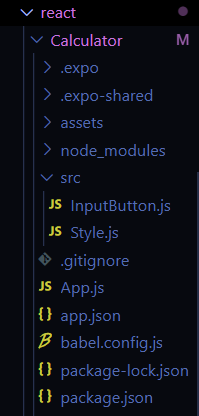

# Calculator

I couldn't send my whole file, so I share with you the files I modified or created

## Getting Started

You have to create a new directory :src .
Then, create a new source file called Style.js and InputButton.js in the src/ directory .

## Project

Here is my second repo where you can see the calculator made with react.js : https://github.com/Dona-dky/Calculator-react